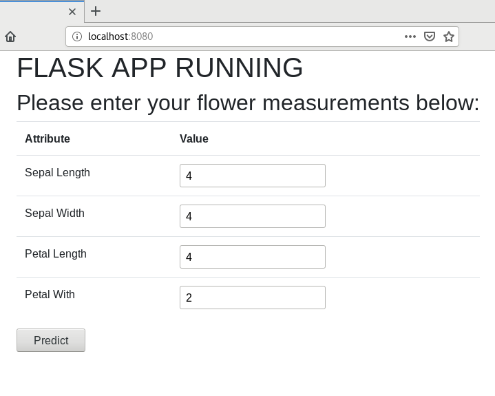
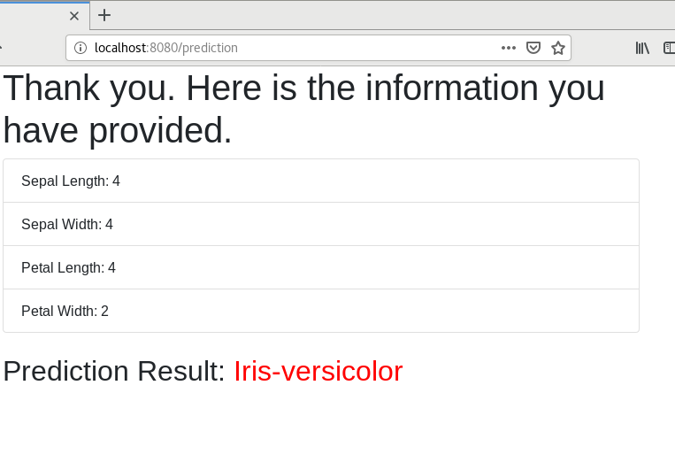

This is a simple iris flower classification model deployment project as flask app.

## Directly run on Docker without building

`  docker run --rm -d -p 8080:8080 erkansirin78/flask-iris-classification:2021-3 `

## Build an image (Dockerize) and run on Docker container
- Download project
` git clone https://github.com/erkansirin78/flask-iris-classification.git ` 

` cd flask-iris-classification `

- Build image 
` docker image build -t my_flask_iris:1.0 . ` 

- Run container 
` docker run --rm --name flask_iris -p 8080:8080 -d my_flask_iris:1.0 ` 

- Open browser http://localhost:8080/

Enjoy your predictions.

## On Kubernetes
- You can deploy the model/app on Kubernetes with deployment object.

- You can deploy this model/app on Openshift just using git project url with OpenShift build menu.

Input web ui:

Predictions:

